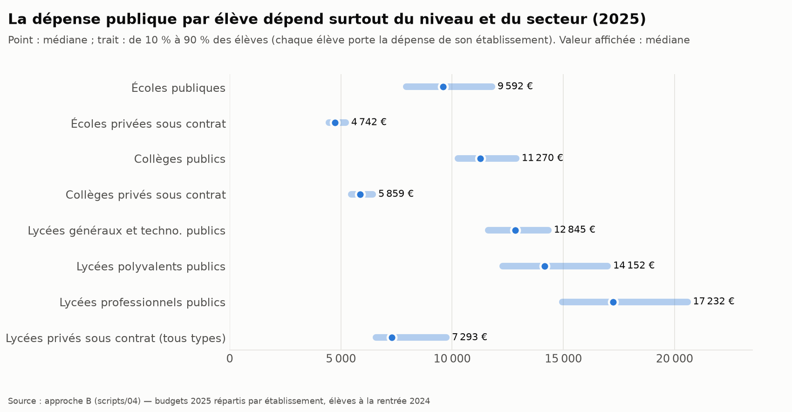
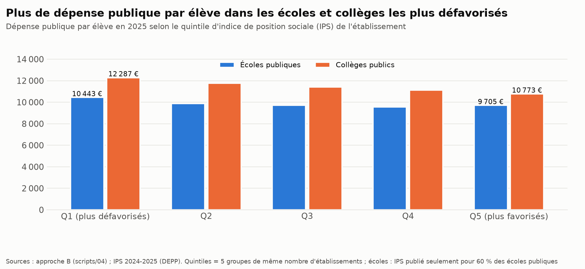
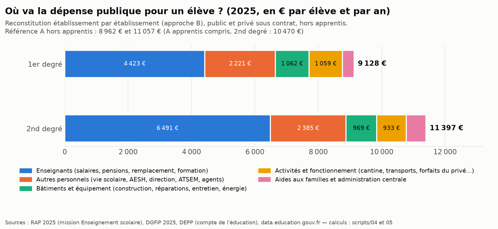
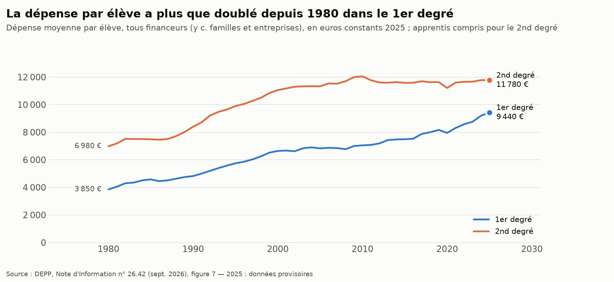

# Combien coûte un élève à la puissance publique ? France, 2025

*Projet de sociologie, dossier de calcul. Données officielles consultées le 4 octobre 2026. Hypothèses : [hypotheses.md](hypotheses.md). Sources : [sources.md](sources.md). Les termes techniques sont expliqués dans le [lexique](#lexique) (§ 2).*

> **Réponse courte.** En 2025, l'État, les collectivités territoriales et les autres administrations publiques ont dépensé en moyenne **environ 9 700 € par élève et par an** (9 710 € ; données 2025 provisoires).
> - **≈ 8 960 €** pour un écolier (maternelle, élémentaire) ;
> - **≈ 10 470 €** pour un élève du 2nd degré, apprentis du secondaire compris (convention de la DEPP) ;
> - **≈ 11 060 €** pour les seuls collégiens et lycéens ; sans les apprentis, la moyenne d'ensemble est de 9 970 €.
>
> **Ce qui fait varier le chiffre :**
> - le périmètre (avec ou sans apprentis, avec ou sans allocation de rentrée scolaire, convention retenue pour l'apprentissage) le fait aller de **9 530 à 9 980 €** (§ 3) ; si l'on comptait les bourses et l'allocation de rentrée comme dépenses des familles (financement final), il serait inférieur d'environ 3 % (calcul possible pour 2024 seulement) ;
> - une autre convention pour les retraites des fonctionnaires le ferait baisser d'environ **1 000 à 1 200 €** (§ 8) ;
> - notre reconstitution établissement par établissement (hors apprentis, élèves de l'Éducation nationale) donne **10 203 €**, soit +2,4 % par rapport au calcul A hors apprentis, 9 968 € (§ 4).
>
> **D'un établissement à l'autre**, la dépense varie surtout selon le niveau et le secteur : environ 4 800 € de dépense publique pour un écolier du privé sous contrat (sans ce que paient les familles et les organismes gestionnaires), environ 14 350 € pour un lycéen du public. À type d'établissement égal, les écarts sont plus modérés : 8 écoliers du public sur 10 se situent entre 8 000 et 11 800 €.

> **Quel chiffre citer ?** Retenez **9 710 €** (≈ 9 700 €) pour 2025, en précisant « données provisoires ». Proposition de citation :
> « D'après le compte de l'éducation de la DEPP, la puissance publique (État, collectivités et autres administrations publiques) a dépensé en 2025 environ 9 700 € par élève ou apprenti du 1er et du 2nd degré (apprentis du secondaire compris ; calcul de l'auteur : dépense moyenne par élève × part des financeurs publics ; DEPP, *Note d'Information* n° 26.42, septembre 2026 ; données provisoires). »
> Les autres chiffres du dossier sont des variantes (9 968 € sans les apprentis), des contrôles (approche B, hors apprentis : 10 203 €) ou la dépense totale, familles et entreprises comprises (10 601 €).

---

## 1. La réponse en bref

| Dépense **publique** par élève, 2025 | 1er degré | 2nd degré | Ensemble |
|---|---|---|---|
| **A. Calcul à partir du compte de l'éducation (DEPP) : notre référence**, apprentis compris | **8 962 €** | **10 470 €** | **9 710 €** |
| A'. Même calcul, élèves sous statut scolaire seulement (hors apprentis) | 8 962 € | 11 057 € | 9 968 € |
| B. Reconstitution établissement par établissement (élèves de l'Éducation nationale, hors apprentis) | 9 128 € | 11 397 € | 10 203 € |
| *Pour mémoire : dépense totale, familles et entreprises comprises (DEPP ; ensemble : moyenne calculée par nous)* | *9 440 €* | *11 780 €* | *10 601 €* |

Six enseignements :

1. **La puissance publique paie environ 9 euros sur 10** de la dépense d'éducation d'un élève : 91,6 % en moyenne, 94,9 % dans le 1er degré, 88,9 % dans le 2nd degré (environ 92,7 % sans les apprentis). Le reste vient des familles (cantine, fournitures…) et des entreprises (surtout l'apprentissage).
2. **L'État paie environ les deux tiers** de la dépense publique, surtout les enseignants, y compris ceux du privé sous contrat. **Les collectivités paient presque tout le reste** : bâtiments et réparations, agents (ATSEM, entretien, restauration), cantines, transports. Dans le 1er degré, elles financent 38 % de la dépense totale, surtout par les communes.
3. **Les enseignants représentent environ la moitié** de la dépense publique par élève (48 % dans le 1er degré, 57 % dans le 2nd). Les bâtiments et l'équipement (construction, rénovation, grosses réparations, équipement, entretien, énergie) en représentent environ 10 % (§ 5).
4. **Un lycéen coûte nettement plus qu'un écolier.** D'après nos calculs à partir des données de la DEPP (approximation, [H-A5](hypotheses.md#a-approche-a--compte-de-léducation-depp)), la dépense publique serait d'environ 12 200 € par lycéen de la voie générale et technologique et 13 500 € dans la voie professionnelle, contre environ 9 000 € par élève d'élémentaire (§ 3). Dans notre reconstitution B, elle est d'environ 14 350 € dans un lycée public, contre 9 800 € dans une école publique (§ 4).
5. **Les élèves des écoles et collèges publics de l'éducation prioritaire reçoivent davantage de dépense publique**, par rapport aux établissements publics hors éducation prioritaire : +12 % dans les écoles de REP+, +14 % dans les collèges de REP+. Dans notre modèle, l'écart vient du nombre d'enseignants et de personnels par élève (classes dédoublées, effectifs réduits). Les primes et l'ancienneté des enseignants ne sont pas observées par établissement (§ 4).
6. **Le chiffre dépend de conventions comptables.** La plus lourde concerne les retraites des fonctionnaires : avec une autre convention, la dépense baisserait d'environ 1 000 à 1 200 € par élève (§ 8).

---

## 2. Ce que l'on mesure

**« La puissance publique », et non « l'État » seul** ([H-G3](hypotheses.md#g-cadrage-général)). On additionne les dépenses de trois catégories d'acteurs :

- **l'État** (tous ministères) : surtout les salaires et les retraites des enseignants, du public comme du privé sous contrat ;
- **les collectivités territoriales** :
  - les communes, pour les écoles : bâtiments, ATSEM, cantines, entretien ;
  - les départements, pour les collèges ;
  - les régions, pour les lycées et une grande partie des transports scolaires ;
- **les autres administrations publiques** : surtout les CAF, avec l'allocation de rentrée scolaire.

On **exclut** ce que paient les familles (cantine, fournitures, frais du privé) et les entreprises (apprentissage, taxe d'apprentissage). L'État seul donnerait un chiffre trompeur : il ne paie ni les bâtiments, ni les réparations, ni les cantines.

**« Un élève »** ([H-G2](hypotheses.md#g-cadrage-général)) : un élève de maternelle, d'élémentaire, de collège ou de lycée, en France (métropole et outre-mer, Mayotte comprise ; hors Nouvelle-Calédonie, Polynésie française, Wallis-et-Futuna et Saint-Pierre-et-Miquelon). Les étudiants de BTS et de classes préparatoires sont exclus, même au lycée. Le champ précis dépend de l'approche :

- **référence A** : convention de la DEPP. Elle couvre le public et le privé (sous contrat et hors contrat), l'Éducation nationale et l'enseignement agricole, les établissements de santé et les apprentis du secondaire, soit 12,6 millions de jeunes en 2025 ;
- **approche B** : les 11,9 millions d'élèves des écoles et établissements de l'Éducation nationale, publics et privés sous contrat.

**« Le coût moyen »** : la dépense de l'année (salaires, fonctionnement et investissements de l'année), divisée par le nombre d'élèves ([H-G5](hypotheses.md#g-cadrage-général), [H-G7](hypotheses.md#g-cadrage-général)). Dernière année disponible : **2025**, données provisoires publiées le 29/09/2026.

**Trois approches complémentaires.** Elles ne sont qu'en partie indépendantes : B reprend de la DEPP environ un cinquième de ses montants, et les chiffres d'Eurostat et de l'OCDE sont transmis par la DEPP.

| Approche | Principe | Intérêt |
|---|---|---|
| **A** | dépense moyenne par élève × part des financeurs publics, publiées chaque année par la DEPP | calcul simple à partir de chiffres officiels ; dépense moyenne publiée depuis 1980, part des financeurs par degré depuis 2006 |
| **B** | budgets 2025 répartis établissement par établissement | l'idée de départ ; montre les écarts entre établissements |
| **C** | comptabilité nationale (INSEE), statistiques internationales (Eurostat, OCDE) | vérifier l'ordre de grandeur |

### Lexique

| Terme | Définition |
|---|---|
| **DEPP** | Direction de l'évaluation, de la prospective et de la performance : service statistique du ministère de l'Éducation nationale |
| **DIE** | dépense intérieure d'éducation : tout ce que dépensent l'État, les collectivités, les autres administrations publiques (CAF…), les familles et les entreprises pour l'éducation |
| **Financement initial / final** | qui paie en premier / qui dépense au final ; les bourses, par exemple, sont versées par l'État, puis dépensées par les familles |
| **CAS Pensions** | compte de l'État qui finance les retraites des fonctionnaires ; en 2025, l'État y verse 78,6 % du traitement de base de chaque fonctionnaire civil (pensions et invalidité) |
| **ETP** | équivalent temps plein ; un enseignant à mi-temps compte pour 0,5 |
| **H/E** | heures d'enseignement hebdomadaires assurées par les enseignants, rapportées au nombre d'élèves (heures-professeur par élève), publiées par établissement et par niveau ; ce n'est pas l'emploi du temps d'un élève |
| **IPS** | indice de position sociale : mesure le milieu social moyen des élèves d'un établissement, à partir de la profession des parents (plus il est élevé, plus le public est favorisé) |
| **REP, REP+** | réseaux d'éducation prioritaire (REP+ : les plus défavorisés), qui reçoivent des moyens supplémentaires |
| **ATSEM** | agents des communes qui assistent les enseignants de maternelle |
| **AESH** | accompagnants des élèves en situation de handicap |
| **AED, CPE** | assistants d'éducation (« surveillants »), conseillers principaux d'éducation |
| **EPLE** | établissement public local d'enseignement : collège ou lycée public |
| **OPCO** | opérateurs de compétences : organismes qui financent l'apprentissage avec les contributions des entreprises |
| **RAP** | rapport annuel de performances : budget de l'État réellement exécuté, par programme et par action |
| **COFOG** | classification des dépenses publiques par fonction, utilisée par l'INSEE |
| **UOE** | collecte statistique commune à l'UNESCO, à l'OCDE et à Eurostat |

---

## 3. Approche A : calcul à partir du compte de l'éducation (DEPP)

### Principe

Chaque année, la DEPP rassemble toutes les dépenses d'éducation, quel que soit le payeur. C'est la dépense intérieure d'éducation, qui atteint 199,2 Md€ en 2025 tous niveaux confondus, enseignement supérieur et formation continue compris. Le 1er et le 2nd degré en représentent 133,8 Md€, pour 12,6 millions d'élèves et d'apprentis (effectif déduit des chiffres de la DEPP, [H-E2](hypotheses.md#e-effectifs-délèves)).

La DEPP publie la dépense moyenne par élève et la part de chaque financeur, mais **pas leur produit**, c'est-à-dire la dépense publique par élève. C'est ce que nous calculons ([H-A1](hypotheses.md#a-approche-a--compte-de-léducation-depp)) : dépense publique par élève = dépense moyenne par élève × part des financeurs publics. La puissance publique paie ainsi environ 122,5 Md€ pour le 1er et le 2nd degré.

### Résultats 2025 (provisoires)

| | Dépense totale par élève | Part publique | **Dépense publique par élève** | dont État | dont collectivités | dont autres administrations publiques |
|---|---|---|---|---|---|---|
| 1er degré | 9 440 € | 94,9 % | **8 962 €** | 5 201 € | 3 626 € | 134 € |
| 2nd degré (apprentis compris) | 11 780 € | 88,9 % | **10 470 €** | 7 924 € | 2 312 € | 234 € |
| **Ensemble** | 10 601 € | 91,6 % | **9 710 €** | 6 552 € | 2 974 € | 184 € |

*Source : DEPP, NI 26.42 (septembre 2026), figures 4, 5 et 7 ; calcul : [scripts/01](scripts/01_approche_A_compte_education.py) ; tableau [A1](resultats/A1_depense_publique_par_eleve.csv).*

**Vérification de la méthode.** Appliquée à 2024, elle retrouve la dépense totale moyenne publiée par la DEPP : 10 352 € calculés, contre 10 350 € publiés.

**Évolution.** En 2024 (données provisoires publiées en septembre 2025, NI 25.52), la dépense publique était de 9 493 € par élève : +217 € en un an, en euros courants. Environ la moitié de cette hausse (environ 110 € par élève) correspond à la hausse des contributions de l'État au CAS Pensions pour la mission « Enseignement scolaire » (+1,39 Md€), due notamment au relèvement de 4 points du taux de cotisation retraite en 2025 ; ce relèvement explique à lui seul environ 94 € par élève. C'est une convention comptable, qui n'augmente pas les moyens des élèves : selon la Cour des comptes, la masse salariale des actifs de la mission n'a progressé que de 0,3 % à périmètre constant (+1,1 % à périmètre courant, transfert des AESH et des AED compris) ([H-G6](hypotheses.md#g-cadrage-général)). La DEPP a depuis légèrement révisé l'année 2024.

**Par niveau.** La dépense totale par élève est publiée ; la part publique est appliquée par approximation ([H-A5](hypotheses.md#a-approche-a--compte-de-léducation-depp)).

| 2025 | Maternelle | Élémentaire | Collège | Lycée général et technologique | Lycée professionnel |
|---|---|---|---|---|---|
| Dépense totale par élève (DEPP) | 9 270 € | 9 530 € | 10 580 € | 13 200 € | 14 590 € |
| Dépense publique (approximation) | ≈ 8 800 € | ≈ 9 050 € | ≈ 9 810 € | ≈ 12 240 € | ≈ 13 530 € |

*Ces valeurs couvrent aussi le privé hors contrat et l'enseignement agricole. Elles ne sont pas comparables aux valeurs par type d'établissement de la section 4.*

### Le chiffre change selon le périmètre retenu

| Variante (tableau [A6](resultats/A6_variantes_de_perimetre.csv)) | Ensemble | Hypothèse |
|---|---|---|
| Référence : financement initial, apprentis compris | 9 710 € | — |
| Sans les apprentis (élèves sous statut scolaire seulement) | 9 968 € (9 951 à 9 980 €) | [H-A3](hypotheses.md#a-approche-a--compte-de-léducation-depp) |
| Financements de l'apprentissage par les OPCO comptés comme publics (borne haute) | 9 981 € | [H-A8](hypotheses.md#a-approche-a--compte-de-léducation-depp) |
| Sans les autres administrations publiques, dont l'allocation de rentrée scolaire des CAF | 9 526 € | [H-A4](hypotheses.md#a-approche-a--compte-de-léducation-depp) |
| En financement final, où bourses et allocation de rentrée sont comptées comme dépenses des familles (2024) | 9 231 € (contre 9 493 € en 2024) | [H-A2](hypotheses.md#a-approche-a--compte-de-léducation-depp) |

---

## 4. Approche B : établissement par établissement

### Ce qui existe et ce qui n'existe pas

L'idée de départ était d'additionner les dépenses de chaque établissement, puis de diviser par ses élèves. **Aucune source publique ne donne les dépenses d'une école ou d'un collège.** Trois raisons :
- les enseignants sont payés directement par l'État ;
- les bâtiments sont dans les budgets des communes, des départements et des régions ;
- les comptes des collèges et lycées ne sont pas publiés au niveau national.

Les rares exceptions sont partielles, comme les dotations de la région Centre-Val de Loire à chacun de ses lycées.

En revanche, l'open data du ministère (data.education.gouv.fr) donne **pour chaque établissement** :
- le nombre d'élèves par niveau : leur somme retrouve le total national DEPP à 0,1 % près au plus ([tableau E2](resultats/E2_effectifs_open_data_vs_DEPP.csv)) ;
- les ETP d'enseignants, par corps dans le 2nd degré (agrégés, certifiés, contractuels…), ainsi que ceux de la vie scolaire et des autres personnels ;
- les heures d'enseignement par niveau (indicateur H/E), l'éducation prioritaire et l'IPS.

### Méthode

On part des budgets exécutés en 2025 par l'État (RAP 2025), les départements et les régions (balances DGFiP 2025). Pour les communes (écoles, fournitures scolaires comprises), les transports scolaires et les CAF, on reprend les montants du compte de l'éducation. On **répartit** ensuite ces montants entre les 58 068 écoles, collèges et lycées de la rentrée 2024, avec les clés les plus précises disponibles ([H-B1 à H-B17](hypotheses.md#b-approche-b--établissement-par-établissement)) :

1. **Salaires des enseignants** (État) :
   - dans les écoles : au prorata des enseignants (ETP) ;
   - dans les collèges et lycées : au prorata des heures d'enseignement de tous niveaux. Un agrégé « pèse » plus qu'un certifié, un contractuel moins. La part des heures données en BTS et classes préparatoires est retirée.
2. **Vie scolaire, direction, administration** : dans les collèges et lycées publics, au prorata des personnels correspondants de l'établissement, pour la part qui revient aux élèves du secondaire (celle des étudiants de BTS et de classes préparatoires est retirée) ; ailleurs, par élève.
3. **Collectivités** :
   - écoles publiques : selon la dépense réelle par élève **de la commune** (comptes 2025 de 3 163 communes, qui scolarisent 68 % des écoliers du public ; les autres écoles reçoivent la moyenne) ;
   - collèges et lycées publics : selon la dépense par élève **du département ou de la région** ;
   - établissements privés sous contrat : forfaits et dotations des collectivités, par élève.
4. **Le reste** (remplacement, formation, AESH, bourses, administration centrale, transports…) : à parts égales entre les élèves concernés.

Au total, environ 54 % de la dépense répartie suit des données propres à chaque établissement : ETP et heures d'enseignement, personnels de vie scolaire et de direction.

### Résultats

| 2025, dépense publique par élève | Établissements | Élèves | **Moyenne** | dont État | dont collectivités | 10 % des élèves sous | Médiane | 10 % des élèves au-dessus |
|---|---|---|---|---|---|---|---|---|
| Écoles publiques | 42 805 | 5 411 627 | **9 808 €** | 5 585 € | 4 089 € | 7 941 € | 9 592 € | 11 788 € |
| Écoles privées sous contrat | 4 600 | 850 123 | **4 800 €** | 3 094 € | 1 568 € | 4 468 € | 4 742 € | 5 211 € |
| Collèges publics | 5 325 | 2 634 043 | **11 451 €** | 8 674 € | 2 543 € | 10 267 € | 11 270 € | 12 879 € |
| Collèges privés sous contrat | 1 661 | 717 884 | **5 926 €** | 4 887 € | 805 € | 5 456 € | 5 859 € | 6 431 € |
| Lycées généraux et technologiques publics | 872 | 776 354 | **12 962 €** | 9 253 € | 3 474 € | 11 629 € | 12 845 € | 14 325 € |
| Lycées polyvalents publics | 768 | 710 065 | **14 443 €** | 10 731 € | 3 478 € | 12 275 € | 14 152 € | 16 992 € |
| Lycées professionnels publics | 762 | 314 309 | **17 588 €** | 13 892 € | 3 462 € | 14 959 € | 17 232 € | 20 579 € |
| Lycées privés sous contrat (tous types) | 1 195 | 473 286 | **7 783 €** | 6 401 € | 1 148 € | 6 572 € | 7 293 € | 9 741 € |
| **Ensemble** | **58 068** | **11 897 389** | **10 203 €** | 6 863 € | 3 158 € | 5 840 € | 10 205 € | 13 687 € |

*Le complément jusqu'à la moyenne correspond aux autres administrations publiques : 134 € par écolier en moyenne (versés aux seuls élèves de 6 ans et plus, [H-B13](hypotheses.md#b-approche-b--établissement-par-établissement)), 234 € par élève du 2nd degré. L'ensemble comprend aussi 80 EREA et établissements divers (9 698 élèves), dont les 76 EREA publics, qui coûtent environ 30 100 € par élève. Tableaux [B1](resultats/B1_depense_publique_par_etablissement_2025.csv) (un établissement par ligne) et [B2](resultats/B2_agregats_et_distribution.csv).*



**Comparaison avec A.** B ne compte pas les apprentis : on la compare donc à A sans apprentis (9 968 €). L'écart est de +2,4 % (+1,9 % dans le 1er degré, +3,1 % dans le 2nd).

Les deux approches aboutissent pourtant presque au même **total** : 121,4 Md€ pour B, contre 121,9 Md€ pour A sans apprentis. L'écart par élève vient donc surtout du **nombre d'élèves**. A compte aussi le privé hors contrat (presque pas financé sur fonds publics), l'enseignement agricole et les établissements de santé : 12,2 millions d'élèves, contre 11,9 millions dans B.

Les totaux ne se correspondent pas pour autant ligne à ligne ([H-B17](hypotheses.md#b-approche-b--établissement-par-établissement)). Selon notre passerelle budgétaire (estimation calée sur 2024), la DEPP classerait dans le supérieur et l'extrascolaire environ 2,6 Md€ de crédits de l'Éducation nationale, en plus des actions explicitement post-bac. B en retire environ 1,1 Md€ en enlevant la part post-bac des heures d'enseignement (0,75 Md€), de la vie scolaire et de la direction (0,36 Md€) : il garde donc environ 1,5 Md€ que la DEPP ne compte pas dans le 1er et le 2nd degré. À l'inverse, A comprend l'enseignement agricole et les autres ministères.

**Lycée professionnel.** B donne un coût plus élevé pour le lycée professionnel que la DEPP. Notre répartition suit les heures d'enseignement effectivement assurées : en lycée professionnel, les enseignants assurent 2,14 heures de cours hebdomadaires par élève (indicateur H/E : heures-professeur rapportées aux élèves), contre 1,26 en voie générale et technologique, en raison des ateliers en petits groupes. Les moyennes par niveau de la DEPP reposent probablement sur la ventilation du budget par action, que la Cour des comptes juge peu fiable par niveau ([H-B4](hypotheses.md#b-approche-b--établissement-par-établissement)).

### Ce que l'approche par établissement apprend (pistes sociologiques)

- **Public et privé.** Un élève du privé sous contrat reçoit environ **moitié moins de dépense publique** qu'un élève du public : −51 % à l'école (4 800 € contre 9 808 €), −48 % au collège (5 926 € contre 11 451 €), −46 % au lycée (7 783 € contre 14 354 €). Cet écart ne mesure ni un coût total ni une efficacité. Il a trois causes :
  - les familles et les associations qui gèrent les établissements privés paient une partie des bâtiments et du personnel non enseignant, ce qui n'est pas compté ici ;
  - les maîtres du privé ne sont pas fonctionnaires : l'État cotise pour leur retraite aux régimes de droit commun, à des taux bien inférieurs à la contribution de 78,6 % du traitement versée pour les fonctionnaires du public en 2025 (§ 8) ;
  - les écoles privées ont un peu plus d'élèves par classe (24,4 contre 20,9 dans le public) et par enseignant (22,8 élèves par ETP d'enseignant, contre 19,4).
- **Éducation prioritaire.**
  - Écoles publiques : 10 682 € par élève en REP+ et 10 818 € en REP, contre 9 559 € hors éducation prioritaire. L'écart vient des enseignants (classes dédoublées) : +1 300 € par élève en REP+. Les communes dépensent un peu moins en REP+ (3 716 € contre 3 890 €), autant en REP (3 912 €).
  - Collèges publics : 12 772 € en REP+ et 12 222 € en REP, contre 11 187 €. L'écart, d'environ 1 585 € par élève en REP+ (calculé sur les valeurs non arrondies), se décompose ainsi : +1 066 € pour les enseignants, +614 € pour la vie scolaire et l'encadrement, −95 € pour les collectivités.
- **Indice de position sociale (IPS).** On classe les établissements en cinq groupes de même nombre (quintiles), du plus défavorisé au plus favorisé.
  - **Collège** : la dépense publique par élève baisse régulièrement quand le public est plus favorisé, de 12 287 € à 10 773 €.
  - **École** : seul le quintile le plus défavorisé se distingue (10 443 €, contre 9 560 à 9 866 € pour les autres).
  - **Lycée** : la dépense est plus élevée dans les lycées défavorisés, mais surtout parce qu'on y trouve davantage de lycées professionnels, plus coûteux.
  - **Communes** : celles où se trouvent les écoles les plus favorisées dépensent un peu plus par élève, 4 149 € contre 3 675 €. L'écart est deux fois plus faible hors Paris (quintiles recalculés sans Paris) : 3 894 € contre 3 651 €. C'est une comparaison entre communes, pas entre écoles.



- **Taille des collèges publics.** Un collège de moins de 200 élèves coûte 13 766 € par élève, contre 10 842 € pour un collège de 800 élèves ou plus. Pour la seule part de l'État, le collégien d'un collège de moins de 200 élèves coûte 1,27 fois plus que celui d'un collège de 500 à 600 élèves (10 911 € contre 8 572 €). La Cour des comptes trouve un rapport voisin pour le seul coût salarial de l'État : 8 900 € contre 6 700 € (rapport public annuel 2026, données 2023).

**Prudence.** Entre collèges et lycées, ces écarts mesurent surtout le nombre d'enseignants et de personnels par élève ; entre écoles publiques, d'abord la dépense de leur commune (environ les trois quarts des écarts, [H-B18](hypotheses.md#b-approche-b--établissement-par-établissement)). Deux éléments non observés jouent en sens contraire ([H-B5](hypotheses.md#b-approche-b--établissement-par-établissement)) :
- les enseignants sont plus jeunes, donc moins payés, en éducation prioritaire : de ce côté, les écarts sont surestimés ;
- les primes de l'éducation prioritaire et la pondération des heures en REP+ ne sont pas rattachées aux établissements concernés : de ce côté, ils sont sous-estimés.

La dépense des collectivités est, elle, répartie avec des moyennes communales, départementales ou régionales.

**Carte interactive des établissements.** La page [carte_etablissements.html](resultats/carte_etablissements.html) montre les 58 068 écoles, collèges, lycées et EREA, publics et privés sous contrat. On peut filtrer par type (maternelle, élémentaire, primaire, collège, trois types de lycée, EREA), par secteur et par région, et chercher un établissement par son nom, sa commune ou son UAI. Pour chacun, la page donne la dépense publique estimée par élève et sa décomposition (enseignants, vie scolaire et direction, autres crédits de l'État, collectivités, CAF), avec l'origine de chaque montant des collectivités (comptes de la commune, moyenne, montant national), l'écart à la moyenne des établissements du même type et du même secteur, et son rang parmi eux. Un bouton choisit l'affichage : la moyenne de chaque département ou chaque établissement ; un clic sur un département ouvre sa fiche (décomposition moyenne, comparaison par type et secteur avec la moyenne nationale). Un autre bouton colore la carte selon la dépense par élève ou selon l'écart : à son groupe pour un établissement, à la moyenne nationale à structure égale (mêmes types, mêmes secteurs) pour un département. Les mêmes données sont dans [carte_etablissements_2025.csv](resultats/carte_etablissements_2025.csv), dont les colonnes sont décrites dans [carte_etablissements_2025_colonnes.md](resultats/carte_etablissements_2025_colonnes.md) ([H-B18](hypotheses.md#b-approche-b--établissement-par-établissement)). Ce sont des estimations. Pour une école publique, la dépense communale par élève est la même dans toute la commune, ATSEM comprises ; pour un tiers des écoliers du public, c'est une moyenne, faute de comptes communaux utilisables (H-B9). 186 établissements ne sont pas comparés à leur groupe : leurs enseignants (écoles) ou tout ou partie de leurs personnels de vie scolaire et de direction (collèges et lycées publics) ne sont pas publiés, leur contrat ne couvre qu'une partie des classes ou plus aucune, ou leur groupe compte moins de 10 établissements. L'enseignement supérieur n'est pas couvert.

### Seine-Saint-Denis et Paris

Fin septembre 2026, le ministre de l'Éducation nationale a affirmé que l'État « investit 13 % de plus par élève à l'école primaire » en Seine-Saint-Denis que la moyenne nationale ; des syndicats du département dénoncent au contraire un « rabais de 30 % ». L'analyse [analyse_seine_saint_denis_paris.md](analyse_seine_saint_denis_paris.md) confronte ces chiffres à nos estimations (hypothèses H-B19 à H-B23, sources : [sources.md, § 11](sources.md#11-seine-saint-denis-et-paris)). En résumé :
- **Écoles publiques, État seul** : un élève coûte à peu près autant dans le 93 qu'à Paris (5 966 € et 6 073 € dans B ; environ 6 050 à 6 150 € et 6 050 à 6 075 € après corrections), tous deux au-dessus de la moyenne (5 585 €). Dans le 93, le surplus vient de l'éducation prioritaire ; à statut égal, Paris a environ 10 % d'enseignants de plus par élève.
- **Écoles publiques, toutes administrations** : Paris est bien au-dessus (15 886 € contre 9 741 €), à cause de la Ville de Paris. Notre clé communale grossit l'écart, surtout en répartissant l'investissement comme le fonctionnement : il serait plutôt de 3 500 à 4 250 € par élève. Pour investir dans les bâtiments, ce sont au contraire les communes du 93 qui dépensent le plus.
- **Collèges publics** : le 93 dépasse Paris (11 902 € contre 10 841 €), surtout par l'investissement du département, la prime de fidélisation et les aides sociales. **Lycées publics** : pour la part de l'État, le 93 est sous la moyenne et sous Paris.
- **Les deux chiffres du débat** : le « +13 % » n'est pas documenté ; notre modèle donne +10,8 à +12,8 % pour la dépense de l'État par écolier, public et privé réunis, surtout parce que le 93 a peu d'élèves dans le privé, mais +6,8 à +9,0 % pour les seules écoles publiques. Le « rabais de 30 % » compare très vraisemblablement l'État seul dans le 93 à tous les financeurs en France ; à périmètre comparable, le 93 est à peu près à la moyenne ou un peu au-dessus.
- **Ce qu'une dépense ne dit pas** : les enseignants du 93 sont plus jeunes, plus souvent contractuels, et leurs absences sont moins bien remplacées.
- **Collèges, lycées et bâtiments** : l'écart des écoles ne se prolonge pas au collège et au lycée, parce que le financeur local change (département, région) et y pèse moins. Une dépense par élève ne dit pas l'état des bâtiments : pour leurs écoles et leurs collèges, le 93 et ses communes investissent plus par élève que Paris ; aucune donnée officielle ne mesure l'état du bâti par département.

---

## 5. Où va l'argent : profs, bâtiments, activités, autres



**Dans les quatre catégories de départ** (approche B, public et privé ; [tableau D2](resultats/D2_decomposition_4_categories.csv), regroupements : [H-D3](hypotheses.md#d-décomposition-par-poste-de-dépense)) :

| Dépense publique par élève, 2025 | 1er degré | 2nd degré |
|---|---|---|
| **1. Enseignants (« profs »)** : salaires et retraites, remplacement, formation | 4 423 € (48 %) | 6 491 € (57 %) |
| **2. Bâtiments et équipement (« réparations »)** : construction, rénovation, grosses réparations, équipement, entretien, énergie | 1 062 € (12 %) | 969 € (9 %) |
| **3. Activités et fonctionnement** : cantine, transports, actions éducatives, fournitures, forfaits versés au privé, internats | 1 059 € (12 %) | 933 € (8 %) |
| **4. Autres** : autres personnels (vie scolaire, AESH, direction, ATSEM, agents des collectivités), bourses, allocation de rentrée, administration | 2 585 € (28 %) | 3 004 € (26 %) |
| **Total** | **9 128 €** | **11 397 €** |

*Valeurs arrondies : la somme des catégories peut différer du total de 1 € ou de 1 point. La figure ci-dessus scinde la catégorie 4 en « autres personnels » (2 221 € et 2 385 €) et en « aides aux familles et administration centrale » (364 € et 619 €).*

**Détail** ([tableau D1](resultats/D1_decomposition_par_poste.csv), qui donne aussi les versions « public » et « privé »). Dans le 1er degré :
- 3 970 € pour les enseignants des écoles et 453 € pour le remplacement et la formation ;
- 1 642 € pour les personnels communaux (ATSEM, agents) ;
- 857 € d'investissement et 205 € d'entretien et d'énergie ;
- 353 € de restauration et 211 € de transports.

Dans les écoles **publiques** seules, le total est de 9 808 €, dont 4 709 € pour les enseignants et 1 228 € pour les bâtiments.

La décomposition officielle de la collecte UOE (DEPP/Eurostat, 2023, tous financeurs) va dans le même sens ([tableau A7](resultats/A7_decomposition_par_nature_UOE.csv)) :

| 2023 | Enseignants | Autres personnels | Fonctionnement | Investissement |
|---|---|---|---|---|
| 1er degré | 49 % | 25 % | 18 % | 8 % |
| 2nd degré | 51 % | 19 % | 21 % | 9 % |

---

## 6. Recoupements avec d'autres sources officielles

| Source | Année | Dépense publique par élève | Lecture |
|---|---|---|---|
| **DEPP, compte de l'éducation (A)** | 2024 (provisoire) | 9 493 € | référence de la même année |
| INSEE, comptabilité nationale (COFOG), dépenses des administrations publiques | 2024 | **de 8 330 à 9 950 €** avec les mêmes effectifs que A (de 8 860 à 10 580 € avec les seuls élèves de l'Éducation nationale) | borne basse sans les services annexes ; borne haute avec les cantines, internats et transports (en dépenses brutes) et des services du supérieur (CROUS) ; la fonction « enseignement non défini par niveau » (8,6 Md€) n'est pas répartie |
| Eurostat, collecte UOE (données DEPP), élèves en équivalent temps plein | 2023 | 9 141 € (1er degré 8 026 € ; 2nd degré 10 342 €) | moyennes calculées par nous à partir des valeurs publiées : maternelle 7 988 €, élémentaire 8 047 €, collège 9 446 €, lycée (y c. apprentis) 11 561 € |
| OCDE, *Regards sur l'éducation* 2026, dépense publique directe des établissements | 2023 | maternelle 7 985 € ; élémentaire 7 847 € ; collège 9 140 € ; lycée (y c. apprentis) 11 067 € | champ plus étroit : dépenses des établissements seulement |

*Tableaux [C1](resultats/C1_recoupement_COFOG_2024.csv) et [C2](resultats/C2_recoupement_UOE_OCDE_2023.csv).* Hors OCDE, dont le champ est plus étroit, les estimations vont de **8 300 à 10 600 € par élève** selon le champ et le nombre d'élèves retenus : c'est le même ordre de grandeur.

**Comparaison internationale** (OCDE 2023, dépense publique par élève, en dollars à parité de pouvoir d'achat) :

| | France | Moyenne OCDE | Union européenne (25) |
|---|---|---|---|
| Élémentaire | 11 565 | 12 821 | 12 491 |
| Collège | 13 471 | 14 241 | 14 348 |
| Lycée (y c. apprentis) | 16 311 | 13 077 | 13 124 |

La France dépense **moins que la moyenne au primaire et au collège, et plus au lycée** : c'est un constat récurrent des publications de l'OCDE.

**Un chiffre que le budget de l'État ne publie plus.** Depuis 2018, la Cour des comptes recommande au ministère d'indiquer dans ses documents budgétaires « la dépense publique par élève aux différents niveaux de formation », en distinguant le public, le privé sous contrat et l'enseignement agricole (une note thématique de la Cour de juillet 2023 date cette demande de 2017). En avril 2026, cette recommandation n'était toujours pas mise en œuvre : le ministère juge ce calcul « complexe et peu fiable » (note d'exécution budgétaire 2025 : recommandation n° 8, p. 9 et 68 ; réponse du ministère, p. 62 ; suivi, p. 86). La Cour vise l'effort financier de l'État par élève, à afficher à côté de la dépense totale par élève, collectivités, ménages et acteurs privés compris (p. 62). Ce dossier estime ces deux grandeurs (colonnes « dont État » des § 3 et 4 ; dépense totale de la DEPP) ainsi que, surtout, la dépense de l'ensemble des administrations publiques.

---

## 7. Évolution depuis 1980



En euros constants, c'est-à-dire corrigés de l'inflation, la dépense totale par élève a été multipliée par **2,5 dans le 1er degré** (3 850 € en 1980, 9 440 € en 2025) et par **1,7 dans le 2nd degré**, apprentis compris (6 980 €, 11 780 €). Dans le 2nd degré, elle ne progresse plus depuis 2010 (12 050 € cette année-là). *Ces chiffres incluent la part des familles et des entreprises et, dans le 2nd degré, les apprentis ; source DEPP, NI 26.42, figure 7.*

---

## 8. Limites et précautions

- **Données 2025 provisoires.** La DEPP les révisera en septembre 2027. Pour 2024, la révision a été de −0,3 Md€ sur 197 Md€ pour la dépense intérieure d'éducation totale, dont +0,14 Md€ (+0,1 %) pour l'enseignement scolaire du 1er et du 2nd degré (NI 26.42, figure 1 bis).
- **Retraites des fonctionnaires** ([H-G6](hypotheses.md#g-cadrage-général)).
  - Pour ses fonctionnaires civils, l'État verse au CAS Pensions une contribution de 78,28 % de leur traitement de base en 2025 pour les pensions (plus 0,32 % pour l'invalidité, soit 78,6 %), contre 74,28 % jusqu'en 2024 et 82,28 % en 2026. Ce taux est fixé pour équilibrer chaque année le compte : il finance les pensions actuellement versées. Selon un *Focus* du Conseil d'analyse économique (H. Paris, 2025, publié sous la seule responsabilité de son autrice), il mêle une cotisation d'employeur comparable à celle du privé, le financement de dispositifs de solidarité et une subvention d'équilibre, liée au fort déséquilibre démographique du régime (*Focus* n° 121, p. 1).
  - L'Institut des politiques publiques estime à 34,7 % (année 2020, civils et militaires confondus) le taux de cotisation d'équilibre des employeurs de fonctionnaires d'État, si l'État finançait à part la subvention implicite liée au déséquilibre démographique non compensé et les droits propres à certaines professions (IPP, p. 53 et 63). Le *Focus* du CAE y voit une approximation de l'effort contributif de l'État employeur, mais une borne haute : le « juste » taux pourrait se situer entre 25,44 % et 34,7 % (*Focus* n° 121, p. 7). Appliquer ces taux à 2025 est une hypothèse du dossier.
  - Avec ces taux, la dépense publique baisserait d'environ **1 000 à 1 200 € par élève**, soit 8 500 à 8 700 € ([tableau C4](resultats/C4_sensibilite_pensions.csv)).
- **Investissements non amortis** ([H-G5](hypotheses.md#g-cadrage-général)) : une année de gros travaux augmente le coût de cette année-là.
- **Approche B : une modélisation, pas une comptabilité.** Seuls les enseignants et les personnels de l'État sont réellement observés par établissement. Les collectivités le sont par commune, département ou région, et le reste est réparti par élève.
- **Rémunérations réelles non observées** ([H-B19](hypotheses.md#b-approche-b--établissement-par-établissement)). B compte chaque poste d'enseignant au coût moyen national de son corps : ni l'ancienneté, ni les contractuels du 1er degré, ni les primes (éducation prioritaire, prime de fidélisation de la Seine-Saint-Denis, indemnité de résidence), ni les majorations de traitement outre-mer ne sont rattachées aux établissements. Par rapport à la DEPP (*Géographie de l'École* 2026, fiche 21), la part de l'État de B est trop élevée d'environ 3 points en Île-de-France, où les enseignants sont jeunes, et trop basse de 10 à 45 points dans les DROM.
- **Ce qui n'est pas compté.**
  - Les dépenses fiscales, par exemple la réduction d'impôt pour frais de scolarité : 229 M€, environ 18 € par élève ([H-G8](hypotheses.md#g-cadrage-général)).
  - Ce que paient les familles et les entreprises : environ 480 € par écolier et 1 310 € par élève ou apprenti du 2nd degré en 2025, dont environ 550 € des entreprises, surtout pour l'apprentissage (calcul à partir de la DEPP, NI 26.42, figure 4).
  - Les accueils de loisirs organisés par les communes (mercredis, vacances), qui ne relèvent pas de l'enseignement.

---

## 9. Principales sources

- **Source principale** : DEPP, L. Bagot, C. Dutey, C. de Fornel, V. Liogier, S. Rousseau, « En 2025, 199,2 milliards d'euros consacrés à l'éducation, soit 6,7 % du PIB », *Note d'Information* n° 26.42, septembre 2026, https://www.education.gouv.fr/depp/en-2025-1992-milliards-d-euros-consacres-l-education-soit-67-du-pib-506005.
- **Autres publications de la DEPP** :
  - NI n° 25.52 (compte de l'éducation 2024) ;
  - *Repères et références statistiques* 2026 (fiches 10.02, 10.04 et 10.05) ;
  - séries chronologiques « coûts et financements » ;
  - *Géographie de l'École* 2026 ;
  - NI n° 25.58 et 25.59 (élèves à la rentrée 2025) et n° 26.35 (apprentis) ;
  - NI n° 26.36 et *Panorama des personnels* 2025-2026 (salaires).
- **Données par établissement** : ministère de l'Éducation nationale, data.education.gouv.fr (effectifs, personnels, heures, IPS, annuaire).
- **Budget de l'État** : rapport annuel de performances 2025, mission « Enseignement scolaire » ; document de politique transversale Outre-mer 2026 ; DGER (enseignement agricole).
- **Collectivités** : DGFiP, balances comptables 2025 (nature × fonction) ; DGCL, *Les collectivités locales en chiffres* 2026.
- **Comptabilité nationale et statistiques internationales** : INSEE, dépenses des administrations publiques par fonction (COFOG), 2024 ; Eurostat, collecte UOE (2023) ; OCDE, *Regards sur l'éducation* 2026.
- **Cour des comptes** : note d'exécution budgétaire 2025 « Enseignement scolaire » et rapport public annuel 2026.
- **Études utilisées pour la sensibilité aux retraites** (ce ne sont pas des statistiques officielles) : Conseil d'analyse économique, *Focus* n° 121 (H. Paris, 2025, publié sous la seule responsabilité de son autrice) ; Institut des politiques publiques, *Perspectives budgétaires* 2025, chapitre 3.

Liste complète, avec liens, dates et emplacements exacts : **[sources.md](sources.md)**. Chaque dossier `data/raw/…/` contient aussi un `SOURCES.md` (URL de chaque fichier) et un `NOTES.md` (lecture des données).

---

## 10. Reproduire les calculs

Les chiffres de ce rapport sont produits par des scripts Python, à partir des fichiers officiels conservés dans `data/raw/` :

```
python scripts/run_all.py
```

Il faut Python 3.11 ou plus, avec pandas, numpy, openpyxl et matplotlib ; le calcul prend environ deux minutes.

- Les résultats sont écrits dans `resultats/` : tableaux CSV A1 à D2, figures, carte interactive des établissements (`carte_etablissements.html`, avec ses données `carte_etablissements_2025.csv`). La carte charge la bibliothèque Leaflet et deux polices depuis Internet ; ouverte depuis le disque, elle propose aussi le fond « Plan IGN ».
- Chaque valeur lue dans un classeur Excel officiel est tracée dans `tracabilite_*.csv` (fichier, onglet, cellule, libellés vérifiés). Le script contrôle d'abord le libellé de sa ligne, celui de sa colonne, ou les deux (212 valeurs sur 396). Les clés territoriales de *Géographie de l'École* sont repérées par le code ou le nom lu sur leur ligne, avec un contrôle des en-têtes de colonnes.
- Les montants transcrits de PDF officiels (RAP 2025) ou issus d'extractions de bases officielles (balances DGFiP) sont listés dans `resultats/B3_intrants_extractions.csv` et dans [sources.md](sources.md), § 9.
- Le nombre d'élèves par enseignant et par classe (§ 4) et les rapports public/privé sont recalculés à partir du tableau B1 et de la base des écoles (`data/processed/base_ecoles_rentree2024.csv`).
